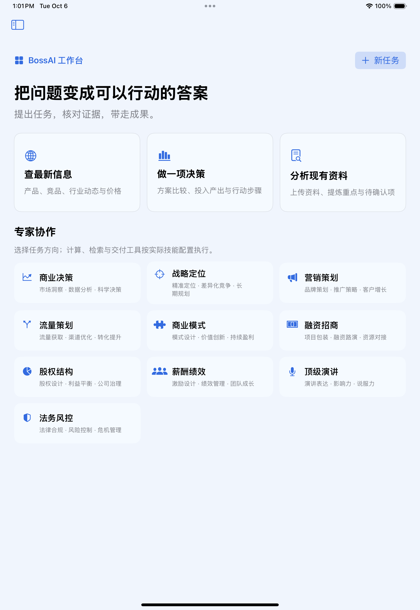
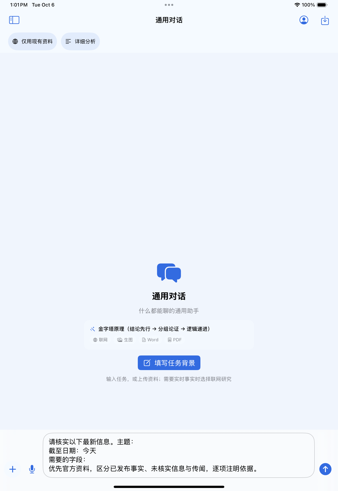
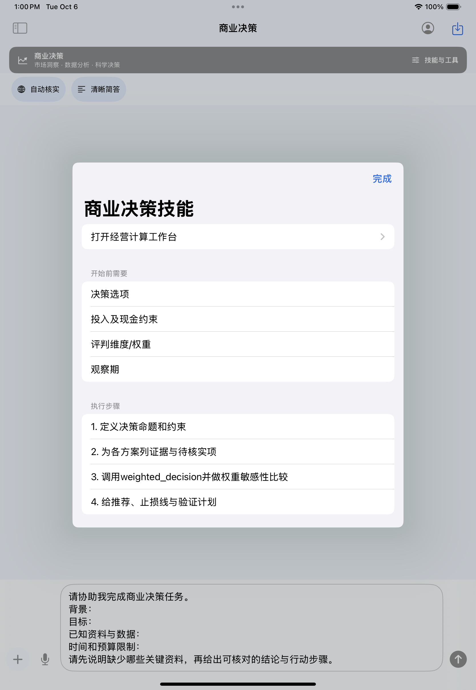

# BossAI 工作台、联网证据与答案体验升级

> 日期：2026-10-06；build：2026100604；最低系统：iOS 17。
> 这是改造交付说明，包含已改内容、代码位置、测试证据和剩余问题。原生流程已完成，结果见下文。旧版本报告保留用于追溯，不能当成本版本结果。

## 总览

BossAI 应该是一套面向经营者的 iPad 任务工作台：说明目标和输入，调用相应专家的工具，核对外部证据，交付一份读得懂、能导出的结果。专家名称、方法论标签和提示词不能单独证明专业能力；可靠计算、可追溯资料、输入限制和明确的未知状态才是可验收能力。

这次集中改造任务入口、搜索解析、证据预算、工具循环、最终答案、模型接口和主题。商业包装、线下培训、代理/服务商机制不因此变成 App 必须实现的功能。资料未体现的真实业务转化率、用户规模、目标设备内存和法律专业数据库，均记为“材料中未体现”。

工作流与模型解耦：`任务模式 → ResearchSearching → 检索/正文 → CitationRegistry → 统一工具循环 → 最终答案 → Markdown/文件交付`。更换模型不改搜索解析、证据编号、专家公式或 SwiftUI 页面。`ModelRequestAdapter` 只放厂商协议参数；现有 Chat Completions 兼容服务商沿用同一流程。非兼容协议仍需要新增传输适配，不能承诺任意模型零改动接入。

## Top 10 问题与处理

优先级 P0 表示会阻断主要流程或直接误导结果；P1 表示主要体验/质量问题；P2 表示后续扩展。成本是本次改造的工程估算，不是承诺工时；效果栏写机制变化，不把预期当实测提升。

| 优先级 | 原有不足及证据 | 已改方案与位置 | 用户可见的效果 | 成本 | 状态/限制 |
| --- | --- | --- | --- | --- | --- |
| P0 | 工具轮次把分析文字逐轮 `fullText += assistantText`，同一回答混入过程与多份结论 | `ChatViewModel.runLoop` 只把无待执行工具的最后一轮作为最终交付；工具历史仍留给 API 续接 | 最终聊天记录只有一份答案；不夹带检索过程或私有思考内容 | 中 | 已改；流式过程中仍可能短暂看到模型先输出的文字，待工具事件到达后清除 |
| P0 | 原生日志实际出现百度HTTP结果跳转被ATS以`-1022`阻断；“有链接却读不到正文”，Windows成功不能代表iOS | `WebSearchService.secureSearchLink` 对已知引擎的`/link`升级HTTPS并保留查询；检索返回与抓取入口均应用；不关闭ATS | 避免已知跳转因HTTP在读取前直接失败 | 低 | 已改并加参数/域名边界回归；验证码与外部站点拒绝仍可能使正文为空 |
| P0 | 通用规则声称固定为某个 OpenAI 模型，和实际配置不符 | `Expert.metaRule` 改为 BossAI；上下文记录当前真实服务商/模型 | 换模型时不会继续冒称另一个模型 | 低 | 已改；旧资料中的身份规则已标为历史说明 |
| P0 | 厂商默认思考模式可能改变工具续接要求；SSE 未区分 `reasoning_content` | `ModelRequestAdapter` 隔离协议；`ChatService` 独立接收思考字段，工具轮次按需续传 | 减少默认协议变化造成的工具循环失败；思考字段不展示为答案 | 中 | 已改；DeepSeek 适配明确快速模式。高级思考模式开关与跨用户轮次思考持久化未实现 |
| P1 | 固定窗口容易配错摘要；360实际是`li.res-list`，原文地址藏在`data-mdurl` | SwiftSoup 2.13.9按结果DOM容器提取；匹配li/div；校验原文地址 | 标题和摘要对应同一条结果；可用原文地址减少跳转 | 中 | 已改；未知布局只留标题/链接，不编造摘要；原文属性不代表事实已核实 |
| P1 | 融合引擎先截前6条再排序，优质候选可能在排序前丢掉 | `WebSearchService` 扩大有限候选池到最多24条，再按查询相关性/有限权威域名/传闻惩罚排序并截取 | 更相关的候选有机会进入最终检索上下文 | 低 | 已改；只是启发式排序，没有搜索准确率百分比承诺 |
| P1 | “最新”一律等同最近30天，误排仍在售但发布较早的产品 | `SearchRecency` 只对明确今天/本周/本月限制时间；最新在售默认 any | 不会仅因发布日期超过30天就漏掉产品 | 低 | 已改；各 HTML 引擎的 after 提示不是硬过滤 |
| P1 | 重复查询、多轮追加证据和最多16轮请求，使费用、等待与上下文不断增长 | `ResearchBudget` 每轮任务最多12个唯一查询、32000字符证据、单份12000字符；批并行最多4主题；工具请求最多8轮；重复查询复用 | 少重复联网和重复阅读；截断/缺失会传给模型，不能声称完整覆盖 | 中 | 已改；字符不是 token；历史消息和其他工具结果还需统一总上下文预算 |
| P1 | 首次打开不知道该输入什么，专家的可执行工具藏在菜单里 | `MainView.WelcomeView` 三类任务卡；`EmptyStateView` 背景模板；专家横幅直接打开技能与计算工作台 | 有明确入口；能看到输入要求、公式、交付标准与边界 | 中 | 已改；缺少计算器的专家不展示空计算入口 |
| P1 | 主题主要是颜色，正文大面积蓝字/框架标签，阅读和操作缺乏层级 | 分离正文和标题字体；动态明暗底色、卡片形状/密度/阅读宽度；最终回答增加复制按钮；完整正文默认展开 | 首页和聊天更有层次；完整答案由用户主动折叠 | 中 | 已改；真实设备大字体、对比度和分屏极窄宽度仍需补验收 |

## 功能模块总表与较弱功能

评分是基于源码与当前验收能力的主观工程判断，满分10；不等于用户满意度、模型准确率或真机性能。未解决项明确写“待做”。不为替换而替换经过测试的模块。

| 模块 | 职责/依赖 | 工程评分 | 本轮判断 | 具体弱点与解决方案 | 期望效果/成本 |
| --- | --- | --- | --- | --- | --- |
| iPad 任务入口 | SwiftUI NavigationSplitView、任务模板、草稿容器 | 7 | 重构已做 | 三类入口和专家卡片；新任务按钮占安全区；后续增加任务状态及历史筛选 | 降低空白输入门槛；后续2–4天 |
| 联网检索与解析 | ResearchSearching、WebSearchService、SwiftSoup | 6 | 解析替换已做，检索层保留优化 | DOM/候选排序/去重已改；无结果仍无法精确区分验证码、超时、API配额或真正无命中。待做：结构化 SearchReport、逐引擎状态和失败分类 | 方便定位“搜不到”；2–4天，不承诺绕过反爬 |
| 证据与时效 | ResearchCore、CitationRegistry、CitationPresentation | 7 | 保留优化 | 来源和引用分开，未知编号保留警示；发布时间可能来自摘要，字段级真假仍靠核对。待做：字段—证据映射、日期出处/可信状态、冲突对照 | 从链接追溯进步到字段追溯；4–7天 |
| 答案与工具循环 | ChatService、ChatViewModel、SSE decoder | 7 | 重构已做 | 最终交付和工具过程分开；去重与预算已做。待做：全上下文 token 预算、按请求日志和断点恢复 | 降低复杂任务超时与历史膨胀；3–5天 |
| 表格与 Markdown | 现有 MarkdownView/MarkdownTableView | 7 | 保留前轮修复 | 换行撑高、横向查看列、完整行/完整答案、后台解析缓存已有回归覆盖；嵌套列表、复杂 CommonMark、超长单元格仍弱。评估 MarkdownUI 后先替换非表格块，保留已验收表格策略 | 扩展语法且避免表格倒退；3–5天 |
| 专家工具与本地计算 | 11个角色契约、BusinessCalculators、资料工具 | 7 | 保留优化 | 当前有公式和输入校验，不是只有 prompt；部分专家仍主要做流程/结构检查。增加企业资料、专业案例和任务级评价集；不要把章节齐全当专业结论正确 | 能力按具体交付验收；持续1–3周 |
| 专业资料检索 | ExpertKnowledgeService、本地 StoredFile 文本 | 5 | 待重构 | 当前关键词检索限制近200份/前20000字符，缺分块、语义检索、页码出处。先分块+文档/页/段编号+本机FTS；SQLite.swift 可作为独立索引库，保留 SwiftData 主库 | 降低漏检、精确定位段落；5–10天；尚未接入推荐库 |
| 长期记忆 | MemoryService、SwiftData MemoryItem | 5 | 待重构 | 自动提取可能把假设或过时信息当用户事实；没有完整人工确认/失效策略。改成待确认事实、来源消息ID、确认/撤销、更新时间和过期状态 | 防止“记住了错误”；3–6天 |
| 文件导入与交付 | DocumentBuilder、FileImportService、FileStore | 7 | 保留已测试实现 | PDF后台多页、Word长表、Excel稀疏列等已有回归；PPT版式模板、复杂Office样式、页内来源锚点仍弱 | 增加稳定模板与样式验收；5–10天 |
| 图片生成与展示 | ImageService、ImageThumbnailWorker、文件持久化 | 6 | 保留优化 | 已后台缩略图；历史图片完整Data仍由SwiftData持有，长会话需真机内存验证。未来外置原图到文件URL，再评估Nuke缓存 | 减少模型对象内存与重复解码；3–5天；未接入Nuke |
| 主题与可访问性 | AppTheme、SwiftUI语义色/字体 | 7 | 保留优化 | 本轮明暗底色、标题字体、密度/形状已改；仍需6主题真机大字体及对比度验收 | 阅读差异可见；验收1–2天 |
| 网络/预算/错误 | BoundedHTTPClient、BudgetTracker | 6 | 保留优化 | 有响应/超时/请求轮数边界；预算单价为估算，不是账单；搜索错误信息不够细 | 请求日志、失败分类、实际usage与账单分开；2–4天 |
| 本地模型 | 材料源码未体现推理运行时 | — | 不加入本轮MVP | MLX Swift LM/llama.cpp 属于未来运行时选型；需确认目标iPad、RAM、系统版本、权重许可和下载/取消策略 | 不把“仅用现有资料”误称完全离线；专项1–3周 |
| 备份与资料持久化 | SwiftData、BackupService、ZipArchive | 7 | 保留已测试实现 | 加密、CRC和边界有回归覆盖；大规模资料、备份恢复后的关联和耗时需真实资料验证 | 用真实脱敏样本补长期稳定性；2–4天 |

### 较弱功能的具体改法与验收

下表是未在本轮完成的工作，不计入已交付能力。按影响与成本排序；不用无关开源仓库包装成专业能力。

| 优先级/证据文件 | 具体问题 | 可实施的改法/参考 | 期望效果 | 验收与成本 |
| --- | --- | --- | --- | --- |
| P1 `ChatViewModel.ensureFileCache`、`MemoryService.extract` | 附件缓存按需使用但首次加载整个资料库；记忆响应先完整下载再检查1MB，检查不能限制下载期间峰值 | 缓存改成按消息附件UUID批量查询+有限LRU；记忆接入现有BoundedHTTPClient读取上限，分离下载和JSON解析 | 资料量增长时只持有需要的记录；过大响应在下载时终止 | 2000文件会话切换内存/查询数；超限响应URLProtocol夹具；1–3天，需原生复测 |
| P1 `WebSearchService.searchUnranked/fusedSearch` | 无命中和引擎故障均可能返回空数组；并行融合仍等待最慢引擎；API补充源先截取也可能降低排序机会 | ResearchSearching返回SearchReport（hits、每引擎耗时/状态/是否验证码、缺失）；统一候选池去重排序；明确整体deadline并取消超时子任务。SearXNG只作可部署服务候选 | 用户知道失败原因；慢引擎不无界拖延；API和HTML候选同一规则 | 一快一慢一失败夹具、取消传播、断网/验证码；2–4天；当前单引擎已有超时，但非端到端延迟保证 |
| P1 `MemoryService`、`MemoryItem` | 有来源标题，缺来源消息ID和事实确认；自动update可能覆盖旧事实 | 增加pending/confirmed/expired状态、messageID、updatedAt；抽取先写pending；设置页逐条确认/撤销；只注入confirmed；备份迁移保留版本 | 用户能纠错，过时记忆不会自动当真 | 虚构AI建议不得入确认库；更新可撤销；旧数据迁移；3–6天；没有适合直接替代完整产品流程的仓库依据 |
| P1 `ExpertKnowledgeService`、`StoredFile` | 近200份/前20000字符会漏检，全文关键词无页段出处 | 导入时按段/页分块，存documentID/page/chunkID；SQLite.swift独立FTS索引；查询只取候选段并保留出处；索引版本失效后重建 | 文件后半部分也可命中；结果能回到证据段 | 长PDF末页关键词、中文分词、重复文件、删除重建；5–10天，先FTS再评估语义向量 |
| P1 `ChatViewModel.buildAPIMessages/runLoop` | 初始上下文已有最近40条/48000字符和附件30000字符限制；但不含system及后续全部工具返回，截断也缺统一提示 | 统一ContextBudget按配置的上下文限额保留system/当前问题/必要tool对；历史摘要与原文分开；截断告知缺失；不能截断JSON或留下缺配对tool_call；按实际usage校准 | 保留现有限制，进一步减少复杂工具任务的拒绝/费用和静默遗漏 | 40轮+大附件+多工具夹具验证预算与协议完整性；3–5天；上下文限额必须由配置提供，不能猜模型能力 |
| P1 `ChatViewModel.send/runLoop` | 部分`try? modelContext.save()`会隐藏会话保存失败；FileStore已具备原子写入与保存失败清理，不能记为缺失 | 会话关键写入统一do/catch、回滚/恢复草稿并显示失败；复用已有FileStore一致性机制；恢复时补记录/文件存在校验 | 用户收到真实保存状态；避免界面看似发送却未保存 | 磁盘不足、数据库保存失败、取消后一致性；1–3天 |
| P2 `ImageService`、`Message.imageData` | 图片处理后台化后，持久层仍持有原图Data；重复展示缺统一解码预算 | 原图外置到沙盒文件，用imageID/URL关联；先生成缩略图；Nuke固定版本适配文件URL、缓存预算与取消；恢复备份时重建路径 | 减少大图解码和会话模型对象负担 | 50张大图、原图导出、取消、备份恢复；3–5天；尚未接入Nuke |
| P2 `MarkdownView`、`MarkdownTableView` | 手写解析覆盖有限；极大表完整渲染成本较高 | 用相同快照集评估MarkdownUI替换非表格块；表格保留完整数据与横向可达；长行分块/惰性渲染必须不破坏复制/导出 | 增加语法覆盖，控制长文成本 | 嵌套列表/转义/链接/1000行/流式中间态；3–5天；MarkdownUI维护模式，先固定版本评估 |
| P2 `ExpertSkillSheet`、`ExpertWorkbenchView` | 技能步骤仍可能显示内部计算器ID；JSON计算输入对经营者门槛较高 | UI将内部ID映射为中文动作；可靠计算内核保留，外层增加带单位/范围/示例的字段表单和结果解释；高级JSON入口另放 | 用户不用理解工具ID或JSON就能填写专业数据 | 七类计算器表单与原内核同输入同输出；2–4天；本轮保留已验收工作台 |

## 已改文件与入口

| 文件 | 修改位置（项目内行号） |
| --- | --- |
| `BossAI/BossAIApp.swift` | 8: private var activeTheme；9: --render-fixture |
| `BossAI/Config/Theme.swift` | 81: var fontDesign；82: var headingDesign；85: private func themedSurface |
| `BossAI/ExpertCore/ReliabilityCore.swift` | 152: static func inferred |
| `BossAI/ExpertCore/ResearchCore.swift` | 3: enum ResearchMode: String, CaseIterable, Identifiable {；15: enum AnswerStyle: String, CaseIterable, Identifiable {；25: enum ResearchIntent {；26: static func needsLiveEvidence(_ text: String) -> Bool { |
| `BossAI/Models/Expert.swift` | 101: static let metaRule |
| `BossAI/Resources/ThirdPartyNotices.txt` | 配置/资源 |
| `BossAI/Services/ChatService.swift` | 15: case reasoningDelta；67: ModelRequestAdapter.apply；116: if let reasoning；199: private func applyTools |
| `BossAI/Services/MemoryService.swift` | 65: ModelRequestAdapter.apply |
| `BossAI/Services/ModelRequestAdapter.swift` | 4: enum ModelRequestAdapter {；5: enum Purpose: Equatable { case chat, memory }；6: static func apply(to body: inout [String: Any], profile: ChatProfile, purpose: Purpose) { |
| `BossAI/Services/ProviderProfiles.swift` | 34: static let chatCandidates；102: static func currentChat；114: static func currentImage |
| `BossAI/Services/ResearchSearchService.swift` | 5: func search(query: String, count: Int, recency: SearchRecency) async -> [SearchHit]；6: func page(url: String, limit: Int) async -> String；8: struct DefaultResearchSearch: ResearchSearching {；9: func search(query: String, count: Int, recency: SearchRecency) async -> [SearchHit] { |
| `BossAI/Services/WebEvidenceExtractor.swift` | 7: static func links；30: private static func destination；36: static func contentHTML |
| `BossAI/Services/WebSearchService.swift` | 65: static func search(；123: private static func fusedSearch；184: static func fetchPageText；441: static func secureSearchLink；420: private static func parseLinks |
| `BossAI/ViewModels/ChatViewModel.swift` | 302: private func runLoop；362: let roundLimit；670: static func runWebSearch；723: private func buildAPIMessages |
| `BossAI/Views/ChatRenderingFixtureView.swift` | 5: struct ChatRenderingFixtureView: View { |
| `BossAI/Views/ChatView.swift` | 22: var initialText；106: struct ExpertBanner；256: struct EmptyStateView；315: private struct TaskControls |
| `BossAI/Views/ExpertSkillSheet.swift` | 10: if !capability.calculators.isEmpty |
| `BossAI/Views/InputBar.swift` | 78: 描述任务、目标 |
| `BossAI/Views/MainView.swift` | 119: private func startNewDraft；129: private func openExpert；467: struct WelcomeView；303: .safeAreaInset(edge: .bottom) |
| `BossAI/Views/MessageRow.swift` | 117: private struct AssistantAnswerView；131: Button(copied |
| `Tests/BossAIExpertCoreTests/ReliabilityCoreTests.swift` | 4: final class ReliabilityCoreTests: XCTestCase {；5: func testSSEWithoutSpace() throws {；10: func testSSEMultilineAndComments() throws {；19: func testSSEOversizedEventRejected() throws { |
| `Tests/BossAIExpertCoreTests/ResearchCoreTests.swift` | 4: final class ResearchCoreTests: XCTestCase {；5: func testLatestAvailableIsNotLimitedToLastThirtyDays() {；10: func testQueryDeduplicationNormalizesWhitespaceAndCase() {；15: func testRelevantEvidenceOutranksUnrelatedDatedAuthorityPage() { |
| `Tests/BossAIUITests/WorkbenchUITests.swift` | 3: final class AppWorkbenchUITests: XCTestCase {；10: private func launch(_ mode: String = "workbench", theme: String = "blue") -> XCUIApplication {；14: private func evidence(_ app: XCUIApplication, _ name: String) {；19: func testWorkbenchCardCreatesDraftWithoutSendingAndModesAreSelectable() { |
| `Tests/BossAIiOSTests/ResearchPipelineTests.swift` | 6: final class ResearchPipelineTests: XCTestCase {；7: private func stream(_ delta: [String: Any], finish: String) throws -> Data {；11: private func toolFrame(query: String, duplicate: Bool = false) throws -> Data {；18: private func chat(_ responses: [Data], provider: String = "fixture") -> ChatService { |
| `project.yml` | 7: packages:；10: exactVersion:；24: CURRENT_PROJECT_VERSION |
| `.github/workflows/expert-quality.yml` | 配置/资源 |


任务模式按钮改为普通按钮加独立选项页面，触控区域至少44点；新任务进入详情区，侧栏可由用户再次打开。初次原生验收发现的模式按钮不可点击问题已经纳入回归，不能只凭截图或编译成功判定可用。

六主题专家横幅采用白字，新增底色对比度检查以4.5:1作为这一控件的工程门槛，参考 [W3C对比度计算说明](https://www.w3.org/WAI/WCAG22/Understanding/contrast-minimum.html)。这项检查不等于整个App已完成可访问性认证。

完整逐文件 SHA256 与改动位置另见 `BossAI-工作台升级-改动位置.json`。新增开源解析器的许可随应用打包为 `ThirdPartyNotices.txt`；测试也检查该资源存在。

## 开源项目评估

查询日期 2026-10-06；Stars 是该时点 GitHub API 快照；最后更新取默认分支最近提交时间（UTC），不是版本发布日期。相似度是“对应模块职责相似度”的主观估计，不代表整个 App 可直接复用。只把实际接入标为已接入。

| 项目 | 技术栈 | License | Stars | 最后提交UTC | 模块相似度 | 可替换模块 | 改造步骤/状态 |
| --- | --- | --- | ---: | --- | --- | --- | --- |
| [scinfu/SwiftSoup](https://github.com/scinfu/SwiftSoup) | Swift / DOM parser | MIT | 5,126 | 2026-10-05T19:16:35Z | 80% | HTML搜索/正文解析 | 已接入；固定2.13.9→DOM适配→保留SearchHit接口→表格/摘要/许可/性能回归 |
| [gonzalezreal/swift-markdown-ui](https://github.com/gonzalezreal/swift-markdown-ui) | Swift / SwiftUI | MIT | 3,932 | 2025-12-28T07:33:47Z | 85% | MarkdownView非表格块 | 参考，未接入；固定兼容版本→主题映射→保留表格和手动折叠→长文/流式回归；维护模式 |
| [kean/Nuke](https://github.com/kean/Nuke) | Swift / NukeUI | MIT | 8,676 | 2026-10-03T23:01:38Z | 75% | 图片加载、缩略图、缓存 | 参考，未接入；外置原图→FileURL适配→设置缓存预算→原图保存与取消测试；不替代生图API |
| [searxng/searxng](https://github.com/searxng/searxng) | Python / search server | AGPL-3.0 | 38,025 | 2026-10-04T06:16:51Z | 75% | 多源搜索服务 | 参考，未接入；自有部署及许可证评估→JSON API→ResearchSearching适配→逐引擎错误与网络验收 |
| [ml-explore/mlx-swift-lm](https://github.com/ml-explore/mlx-swift-lm) | Swift / MLX / Metal | MIT | 829 | 2026-10-05T23:15:16Z | 50% | 未来本地推理运行时 | 参考，未接入；核对tag系统/工具链要求→设备RAM与权重许可→加载/取消→流事件适配→真机性能 |
| [ggml-org/llama.cpp](https://github.com/ggml-org/llama.cpp) | C/C++ / Metal / XCFramework | MIT | 130,444 | 2026-10-06T09:42:59Z | 50% | 未来本地推理运行时 | 参考，未接入；选择固定构建→Swift桥接→权重下载/校验→流式协议→内存/热状态验收 |
| [stephencelis/SQLite.swift](https://github.com/stephencelis/SQLite.swift) | Swift / SQLite | MIT | 10,186 | 2026-09-22T14:28:46Z | 65% | 资料分块与FTS索引 | 参考，未接入；独立索引库→文档/页/段ID→FTS查询→版本迁移和命中回归；不替换SwiftData主库 |


SwiftSoup 已通过 Swift Package Manager 固定为2.13.9，改造路径是 HTML → DOM结果容器/正文 → SearchHit/页面摘录 → 原有统一证据流程。它解决解析问题，不提供搜索索引、专业判断或实时事实验证。

MarkdownUI 当前维护模式；迁移前要保留本项目的完整表格、手动折叠、来源展示和流式节流回归。Nuke 是图片加载/处理组件，不能替换生图接口。SearXNG 是需要部署的服务器方案，不能直接塞进 iOS；只在愿意承担服务运维时通过 ResearchSearching 适配。SQLite.swift 是索引库方案，不能直接产生语义理解；先用FTS建立出处索引再评估嵌入向量。MLX/llama.cpp 要单独评估设备与模型权重，当前没有接入。

## 原生验证与实测

- 源码提交：`816d2f9efccf9ffc95c872f2324cf4bd2c551cf9`；build **2026100604**。
- [IPA原生构建](https://github.com/moli815/aigc-video/actions/runs/37465045960)成功。
- [完整原生验收](https://github.com/moli815/aigc-video/actions/runs/37465045756)：核心 **65/65**；iPad模拟器 **62/62**；合计 **127**，零失败/零跳过。包含一项真实联网诊断，其通过代表返回结构/边界检查通过，不代表检索事实全部正确。
- 设备与配置：`[{"device": {"architecture": "x86_64", "deviceId": "F22FC8BB-6166-471A-868A-40317F40C6B7", "deviceName": "iPad Pro 11-inch (M4)", "modelName": "iPad Pro 11-inch (M4)", "osBuildNumber": "22G86", "osVersion": "18.6", "platform": "iOS Simulator"}, "expectedFailures": 0, "failedTests": 0, "passedTests": 62, "skippedTests": 0, "testPlanConfiguration": {"configurationId": "1", "configurationName": "Test Scheme Action"}}]`。

固定样本测量原始记录（保留单位、波动，不推算性能提升百分比；滚动自动化耗时不是FPS，离线启动不是生产冷启动）：

```text
/Users/runner/work/aigc-video/aigc-video/Tests/BossAIiOSTests/AppPerformanceTests.swift:68: Test Case '-[BossAITests.AppPerformanceTests testLongPDFClockAndMemory]' measured [Memory Peak Physical, kB] average: 33524.941, relative standard deviation: 0.427%, values: [33325.056000, 33386.496000, 33583.104000, 33648.640000, 33681.408000], performanceMetricID:com.apple.dt.XCTMetric_Memory.physical_peak, baselineName: "", baselineAverage: , polarity: prefers smaller, maxPercentRegression: 10.000%, maxPercentRelativeStandardDeviation: 10.000%, maxRegression: 0.000, maxStandardDeviation: 0.000
/Users/runner/work/aigc-video/aigc-video/Tests/BossAIiOSTests/AppPerformanceTests.swift:68: Test Case '-[BossAITests.AppPerformanceTests testLongPDFClockAndMemory]' measured [Memory Physical, kB] average: 83.558, relative standard deviation: 101.109%, values: [77.824000, 192.512000, 135.168000, -61.440000, 73.728000], performanceMetricID:com.apple.dt.XCTMetric_Memory.physical, baselineName: "", baselineAverage: , polarity: prefers smaller, maxPercentRegression: 10.000%, maxPercentRelativeStandardDeviation: 10.000%, maxRegression: 0.000, maxStandardDeviation: 0.000
/Users/runner/work/aigc-video/aigc-video/Tests/BossAIiOSTests/AppPerformanceTests.swift:68: Test Case '-[BossAITests.AppPerformanceTests testLongPDFClockAndMemory]' measured [Clock Monotonic Time, s] average: 1.045, relative standard deviation: 18.582%, values: [1.297127, 0.834425, 0.825336, 1.044387, 1.225212], performanceMetricID:com.apple.dt.XCTMetric_Clock.time.monotonic, baselineName: "", baselineAverage: , polarity: prefers smaller, maxPercentRegression: 10.000%, maxPercentRelativeStandardDeviation: 10.000%, maxRegression: 0.000, maxStandardDeviation: 0.000
/Users/runner/work/aigc-video/aigc-video/Tests/BossAIiOSTests/AppPerformanceTests.swift:77: Test Case '-[BossAITests.AppPerformanceTests testTwoHundredMarkdownMessagesParsingPerformance]' measured [Memory Peak Physical, kB] average: 48869.376, relative standard deviation: 0.000%, values: [48869.376000, 48869.376000, 48869.376000, 48869.376000, 48869.376000], performanceMetricID:com.apple.dt.XCTMetric_Memory.physical_peak, baselineName: "", baselineAverage: , polarity: prefers smaller, maxPercentRegression: 10.000%, maxPercentRelativeStandardDeviation: 10.000%, maxRegression: 0.000, maxStandardDeviation: 0.000
/Users/runner/work/aigc-video/aigc-video/Tests/BossAIiOSTests/AppPerformanceTests.swift:77: Test Case '-[BossAITests.AppPerformanceTests testTwoHundredMarkdownMessagesParsingPerformance]' measured [Memory Physical, kB] average: 0.819, relative standard deviation: 200.000%, values: [4.096000, 0.000000, 0.000000, 0.000000, 0.000000], performanceMetricID:com.apple.dt.XCTMetric_Memory.physical, baselineName: "", baselineAverage: , polarity: prefers smaller, maxPercentRegression: 10.000%, maxPercentRelativeStandardDeviation: 10.000%, maxRegression: 0.000, maxStandardDeviation: 0.000
/Users/runner/work/aigc-video/aigc-video/Tests/BossAIiOSTests/AppPerformanceTests.swift:77: Test Case '-[BossAITests.AppPerformanceTests testTwoHundredMarkdownMessagesParsingPerformance]' measured [Clock Monotonic Time, s] average: 0.005, relative standard deviation: 23.439%, values: [0.003279, 0.003605, 0.005961, 0.005590, 0.005597], performanceMetricID:com.apple.dt.XCTMetric_Clock.time.monotonic, baselineName: "", baselineAverage: , polarity: prefers smaller, maxPercentRegression: 10.000%, maxPercentRelativeStandardDeviation: 10.000%, maxRegression: 0.000, maxStandardDeviation: 0.000
/Users/runner/work/aigc-video/aigc-video/Tests/BossAIiOSTests/AppPerformanceTests.swift:58: Test Case '-[BossAITests.AppPerformanceTests testWordExportClockAndMemory]' measured [Memory Peak Physical, kB] average: 49400.218, relative standard deviation: 0.007%, values: [49393.664000, 49401.856000, 49401.856000, 49401.856000, 49401.856000], performanceMetricID:com.apple.dt.XCTMetric_Memory.physical_peak, baselineName: "", baselineAverage: , polarity: prefers smaller, maxPercentRegression: 10.000%, maxPercentRelativeStandardDeviation: 10.000%, maxRegression: 0.000, maxStandardDeviation: 0.000
/Users/runner/work/aigc-video/aigc-video/Tests/BossAIiOSTests/AppPerformanceTests.swift:58: Test Case '-[BossAITests.AppPerformanceTests testWordExportClockAndMemory]' measured [Memory Physical, kB] average: 1.638, relative standard deviation: 200.000%, values: [0.000000, 8.192000, 0.000000, 0.000000, 0.000000], performanceMetricID:com.apple.dt.XCTMetric_Memory.physical, baselineName: "", baselineAverage: , polarity: prefers smaller, maxPercentRegression: 10.000%, maxPercentRelativeStandardDeviation: 10.000%, maxRegression: 0.000, maxStandardDeviation: 0.000
/Users/runner/work/aigc-video/aigc-video/Tests/BossAIiOSTests/AppPerformanceTests.swift:58: Test Case '-[BossAITests.AppPerformanceTests testWordExportClockAndMemory]' measured [Clock Monotonic Time, s] average: 0.094, relative standard deviation: 51.152%, values: [0.055522, 0.132629, 0.056952, 0.170164, 0.055743], performanceMetricID:com.apple.dt.XCTMetric_Clock.time.monotonic, baselineName: "", baselineAverage: , polarity: prefers smaller, maxPercentRegression: 10.000%, maxPercentRelativeStandardDeviation: 10.000%, maxRegression: 0.000, maxStandardDeviation: 0.000
BOSSAI_BACKGROUND_PDF duration=1.460097603999884 mainActorTicks=66 maxHeartbeatGap=0.03480768100007481
/Users/runner/work/aigc-video/aigc-video/Tests/BossAIiOSTests/ResearchPipelineTests.swift:129: Test Case '-[BossAITests.ResearchPipelineTests testDOMEvidenceExtractionBenchmarkWithOneHundredResults]' measured [Memory Peak Physical, kB] average: 52829.389, relative standard deviation: 0.008%, values: [52826.112000, 52826.112000, 52826.112000, 52834.304000, 52834.304000], performanceMetricID:com.apple.dt.XCTMetric_Memory.physical_peak, baselineName: "", baselineAverage: , polarity: prefers smaller, maxPercentRegression: 10.000%, maxPercentRelativeStandardDeviation: 10.000%, maxRegression: 0.000, maxStandardDeviation: 0.000
/Users/runner/work/aigc-video/aigc-video/Tests/BossAIiOSTests/ResearchPipelineTests.swift:129: Test Case '-[BossAITests.ResearchPipelineTests testDOMEvidenceExtractionBenchmarkWithOneHundredResults]' measured [Memory Physical, kB] average: 2.458, relative standard deviation: 133.333%, values: [4.096000, 0.000000, 0.000000, 8.192000, 0.000000], performanceMetricID:com.apple.dt.XCTMetric_Memory.physical, baselineName: "", baselineAverage: , polarity: prefers smaller, maxPercentRegression: 10.000%, maxPercentRelativeStandardDeviation: 10.000%, maxRegression: 0.000, maxStandardDeviation: 0.000
/Users/runner/work/aigc-video/aigc-video/Tests/BossAIiOSTests/ResearchPipelineTests.swift:129: Test Case '-[BossAITests.ResearchPipelineTests testDOMEvidenceExtractionBenchmarkWithOneHundredResults]' measured [Clock Monotonic Time, s] average: 0.017, relative standard deviation: 7.149%, values: [0.015344, 0.016729, 0.019102, 0.016693, 0.016858], performanceMetricID:com.apple.dt.XCTMetric_Clock.time.monotonic, baselineName: "", baselineAverage: , polarity: prefers smaller, maxPercentRegression: 10.000%, maxPercentRelativeStandardDeviation: 10.000%, maxRegression: 0.000, maxStandardDeviation: 0.000
/Users/runner/work/aigc-video/aigc-video/Tests/BossAIUITests/OfflinePerformanceUITests.swift:10: Test Case '-[BossAIUITests.OfflinePerformanceUITests testOfflineLaunchPerformance]' measured [Duration (AppLaunch), s] average: 6.368, relative standard deviation: 9.829%, values: [7.460912, 6.357726, 5.613488, 5.938114, 6.467827], performanceMetricID:com.apple.dt.XCTMetric_ApplicationLaunch-AppLaunch.duration, baselineName: "", baselineAverage: , polarity: prefers smaller, maxPercentRegression: 10.000%, maxPercentRelativeStandardDeviation: 10.000%, maxRegression: 0.000, maxStandardDeviation: 0.000
/Users/runner/work/aigc-video/aigc-video/Tests/BossAIUITests/OfflinePerformanceUITests.swift:27: Test Case '-[BossAIUITests.OfflinePerformanceUITests testOfflineScrollClockAndMemory]' measured [Memory Physical (app), kB] average: 716.800, relative standard deviation: 48.110%, values: [1187.840000, 815.104000, 917.504000, 446.464000, 217.088000], performanceMetricID:com.apple.dt.XCTMetric_Memory-com.bossai.app.physical, baselineName: "", baselineAverage: , polarity: prefers smaller, maxPercentRegression: 10.000%, maxPercentRelativeStandardDeviation: 10.000%, maxRegression: 0.000, maxStandardDeviation: 0.000
/Users/runner/work/aigc-video/aigc-video/Tests/BossAIUITests/OfflinePerformanceUITests.swift:27: Test Case '-[BossAIUITests.OfflinePerformanceUITests testOfflineScrollClockAndMemory]' measured [Clock Monotonic Time, s] average: 10.610, relative standard deviation: 5.546%, values: [11.657904, 10.131766, 10.273751, 10.129539, 10.855944], performanceMetricID:com.apple.dt.XCTMetric_Clock.time.monotonic, baselineName: "", baselineAverage: , polarity: prefers smaller, maxPercentRegression: 10.000%, maxPercentRelativeStandardDeviation: 10.000%, maxRegression: 0.000, maxStandardDeviation: 0.000
/Users/runner/work/aigc-video/aigc-video/Tests/BossAIUITests/OfflinePerformanceUITests.swift:27: Test Case '-[BossAIUITests.OfflinePerformanceUITests testOfflineScrollClockAndMemory]' measured [Absolute Memory Physical (app), kB] average: 51485.901, relative standard deviation: 1.739%, values: [50061.312000, 50876.416000, 51793.920000, 52240.384000, 52457.472000], performanceMetricID:com.apple.dt.XCTMetric_Memory-com.bossai.app.physical_absolute, baselineName: "", baselineAverage: , polarity: prefers smaller, maxPercentRegression: 10.000%, maxPercentRelativeStandardDeviation: 10.000%, maxRegression: 0.000, maxStandardDeviation: 0.000
/Users/runner/work/aigc-video/aigc-video/Tests/BossAIUITests/OfflinePerformanceUITests.swift:27: Test Case '-[BossAIUITests.OfflinePerformanceUITests testOfflineScrollClockAndMemory]' measured [Memory Peak Physical (app), kB] average: 51815.219, relative standard deviation: 1.997%, values: [50221.056000, 51216.384000, 51802.112000, 52822.016000, 53014.528000], performanceMetricID:com.apple.dt.XCTMetric_Memory-com.bossai.app.physical_peak, baselineName: "", baselineAverage: , polarity: prefers smaller, maxPercentRegression: 10.000%, maxPercentRelativeStandardDeviation: 10.000%, maxRegression: 0.000, maxStandardDeviation: 0.000
```

macOS核心固定样本测量（不是iPad结果）：

```text
/<compiler-generated>:55: Test Case '-[BossAIExpertCoreTests.CitationRegressionTests testHundredsOfRepeatedSearchHitsBenchmark]' measured [Time, seconds] average: 0.005, relative standard deviation: 9.171%, values: [0.004867, 0.004337, 0.005594, 0.005244, 0.004467, 0.005385, 0.004946, 0.004387, 0.004443, 0.004441], performanceMetricID:com.apple.XCTPerformanceMetric_WallClockTime, baselineName: "", baselineAverage: , polarity: prefers smaller, maxPercentRegression: 10.000%, maxPercentRelativeStandardDeviation: 10.000%, maxRegression: 0.100, maxStandardDeviation: 0.100
/Users/runner/work/aigc-video/aigc-video/Tests/BossAIExpertCoreTests/ExpertCoreTests.swift:109: Test Case '-[BossAIExpertCoreTests.ExpertCorePerformanceTests testCalculateThousandScenariosPerformance]' measured [Time, seconds] average: 0.011, relative standard deviation: 3.211%, values: [0.010590, 0.010586, 0.010593, 0.010497, 0.010524, 0.010466, 0.011049, 0.010550, 0.011639, 0.010755], performanceMetricID:com.apple.XCTPerformanceMetric_WallClockTime, baselineName: "", baselineAverage: , polarity: prefers smaller, maxPercentRegression: 10.000%, maxPercentRelativeStandardDeviation: 10.000%, maxRegression: 0.100, maxStandardDeviation: 0.100
/<compiler-generated>:113: Test Case '-[BossAIExpertCoreTests.ExpertCorePerformanceTests testSkillLookupTenThousandTimesPerformance]' measured [Time, seconds] average: 0.004, relative standard deviation: 6.532%, values: [0.003359, 0.003531, 0.003455, 0.003961, 0.003626, 0.003661, 0.003836, 0.004178, 0.003975, 0.003763], performanceMetricID:com.apple.XCTPerformanceMetric_WallClockTime, baselineName: "", baselineAverage: , polarity: prefers smaller, maxPercentRegression: 10.000%, maxPercentRelativeStandardDeviation: 10.000%, maxRegression: 0.100, maxStandardDeviation: 0.100
/<compiler-generated>:76: Test Case '-[BossAIExpertCoreTests.ReliabilityCoreTests testSSEBatchPerformance]' measured [Time, seconds] average: 0.016, relative standard deviation: 7.414%, values: [0.015574, 0.015679, 0.015663, 0.015479, 0.015413, 0.015692, 0.015767, 0.015634, 0.016370, 0.019586], performanceMetricID:com.apple.XCTPerformanceMetric_WallClockTime, baselineName: "", baselineAverage: , polarity: prefers smaller, maxPercentRegression: 10.000%, maxPercentRelativeStandardDeviation: 10.000%, maxRegression: 0.100, maxStandardDeviation: 0.100
```


### 主要性能样本如何解读

| 固定样本/指标 | 平均值或单次值 | 波动RSD | 含义与限制 |
| --- | ---: | ---: | --- |
| 100条DOM结果解析 / Memory Peak Physical, kB | 52829.389 | 0.008% | 固定HTML；不含检索网络和网页真实体积 |
| 100条DOM结果解析 / Clock Monotonic Time, s | 0.017 | 7.149% | 固定HTML；不含检索网络和网页真实体积 |
| 200条离线启动夹具 / Duration (AppLaunch), s | 6.368 | 9.829% | XCT启动指标；不是生产冷启动 |
| 200条离线列表滚动 / Clock Monotonic Time, s | 10.610 | 5.546% | 时间含自动化手势；内存单位kB，不是FPS |
| 200条离线列表滚动 / Absolute Memory Physical (app), kB | 51485.901 | 1.739% | 时间含自动化手势；内存单位kB，不是FPS |
| 200条离线列表滚动 / Memory Peak Physical (app), kB | 51815.219 | 1.997% | 时间含自动化手势；内存单位kB，不是FPS |
| 长文本后台PDF导出 | 1.460s | 单次 | 主线程心跳66次，最大间隔34.81ms；这是调度探针，不是FPS |

联网准确性需和性能分开验收：标题相关不等于字段事实正确，抓取时间不是发布时间，HTTP 200也可能是验证码。新增真实原生联网诊断会记录候选标题/URL/未经核实的日期、检索耗时及首个正文字符数；它不自动给事实打“正确”标签。

Windows用既有测试凭证做了一条真实短流式请求：新服务商参数返回HTTP200、完整SSE、`stop`和`[DONE]`。这只说明接口参数能工作，不是复杂任务的速度/正确率基准。另对四个HTML/RSS端点做一次真实读取；百度样本是疑似验证页，不能写成有效搜索命中。原始结果随交付保留。

### 测试覆盖如何理解

| 类型 | 实际验证内容 | 不能据此推断 |
| --- | --- | --- |
| macOS Swift核心 | 专家能力契约、公式输入/结果、引用去重与编号、SSE字节/Unicode、时效、预算和排序 | 专家能正确解决所有经营问题；iPad真机速度 |
| iOS原生单元/集成 | 注入URLProtocol的完整任务流程、工具循环、禁用联网、供应商协议隔离、DOM、SwiftData、Office/PDF完整性、资源许可 | 所有真实供应商都已付费API测试；实时事实已人工核定 |
| iPad原生UI | 生产SwiftUI组件的任务草稿、模式选择、专家入口、复制、来源、完整表格、手动折叠及横竖屏 | 所有主题/大字体/极窄分屏都通过；所有历史用户数据布局相同 |
| 原生性能样本 | 固定Markdown/DOM/导出/离线启动和滚动操作时间、内存指标、主线程心跳 | 真实网络复杂问题p95、生产峰值RSS、FPS、电量、发热达标 |
| 实际网络探测 | 一条短模型SSE请求；公开端点返回；App在模拟器实际读取3个搜索问题 | 搜索字段正确率提升；全实体完整覆盖；外部服务长期可用 |


### 本版本真实原生搜索样本

每题只测一次；候选数和官方域名数量不等于正确字段数。首篇正文为空代表这次读取没有得到可用摘录，不能写成已读懂官方页面。

| 查询 | 检索秒 | 首篇抓取秒 | 候选数 | 已知官方域名候选数 | 首篇正文字符数 |
| --- | ---: | ---: | ---: | ---: | ---: |
| iPhone 官方 技术规格 site:apple.com | 2.617 | 0.709 | 6 | 6 | 0 |
| 华为 官方 手机 参数 site:huawei.com | 1.745 | 0.826 | 6 | 6 | 3500 |
| 小米 官方 手机 参数 site:mi.com | 1.837 | 1.422 | 6 | 6 | 2776 |

候选标题、原文地址、未经核实的日期和正文摘录见 `BossAI-工作台原生验收/native-live-search-audit_0_E295B3AA-6C22-4C11-9043-3490D66962C2.json`。HTML搜索服务的地域/反爬和JavaScript正文仍是限制；付费搜索API或自有SearXNG适配应以固定任务集比较后决定，不能仅根据一次速度替换。

## 性能风险与 Xcode Instruments 验收方案

| 关注点 | 静态风险/本轮措施 | 原生实测范围 | 真机需回填的数据 |
| --- | --- | --- | --- |
| 主线程 | DOM/页面抓取不在MainActor；Markdown/PDF已有后台Worker；SwiftData保存仍在MainActor | 本版本原生后台导出心跳及固定样本 | Time Profiler主线程最长任务、hitch次数、保存耗时p95 |
| AI请求 | 最多8轮；当前服务商和实际usage；真实请求依赖网络/模型 | 短接口请求、离线URLProtocol完整工具循环 | 固定同一任务20次TTFT/完成耗时p50/p95、总tokens/请求数 |
| 流式输出 | 80ms合并发布；只驱动当前回答；0.25s滚动节流 | 流协议/Unicode/截断回归 | Animation Hitches、滚动FPS、输入延迟、长答案CPU |
| DOM解析 | 固定库、有限容器；多查询与多页面仍可能同时持有较大DOM | 100条结果固定HTML的时间/内存测量 | 2MB真实HTML峰值内存、并行12页面峰值、取消后回落 |
| 列表/表格 | 完整行数/自动行高/横向列；不丢数据导致极大表仍昂贵 | 60行完整性、列可达、横竖屏、长回答 | 1000行/100轮会话的内存、hitches与视图重算范围 |
| 图片内存 | 展示后台缩略图；持久层仍有原图Data | 已有图片解码回归 | 连续50张图峰值、切换会话后回落、Memory Graph引用链 |
| 启动 | 页面任务/专家卡Lazy布局；测试夹具禁用凭证探测 | 离线启动夹具；不能当生产首次启动 | 冷/热启动各10次；生产凭证识别和资料加载分别计时 |
| 网络 | 每请求读取上限/超时；跳转最多2次；HTML反爬是外部限制 | 三主题真实原生检索诊断 | Wi-Fi/蜂窝/弱网/离线、有效命中率、失败类别、重试次数 |
| 持久化/记忆 | 最近40条/48000字符已有边界；尚未与system、证据及其他工具组成统一总token预算 | SwiftData和备份回归 | 2000会话/大量附件保存/搜索/恢复耗时，磁盘体积 |
| 本地模型 | 材料中未体现运行时 | 未测 | 若加入：权重加载、首token、tokens/s、峰值RSS、热状态、电量 |

建议门槛（产品目标，不是本次结果）：连续长回复输入可操作；滚动无持续明显卡顿；大文件导出主线程不被整段阻塞；请求/证据有边界且用户可取消；任何被截断的证据都明确说明。真机帧率、发热、电量和总生产内存不能用模拟器测量替代。

回填CSV字段：`build,device,iOS,theme,fontSize,network,scenario,sampleCount,TTFT_p50_s,TTFT_p95_s,total_p95_s,requestCount,tokens,peakRSS_MB,maxMainTask_ms,hitchCount,FPS,thermalState,verifiedFieldCount,requestedFieldCount,wrongFieldCount,invalidCitationCount,notes`。

搜索质量固定验收集：产品规格/现行政策/企业竞品/用户资料交叉核实各10题；逐题列对象、字段、地区、版本、截止日期及人工核定原文。覆盖率=可核实字段数/要求字段数；错误率和引用错配率单列。未知应如实计为未核实，不能为提高覆盖率填猜测。

## MVP与90天安排

MVP保留任务入口、11角色能力契约/可靠计算、统一搜索证据、完整对话与来源、本地资料/四类文件导出；继续保留模型切换。先不加入课程销售、代理佣金、复杂会员、自动对外发消息、未经验收的本地大模型。

| 时间 | 重点 | 可验收交付 |
| --- | --- | --- |
| 1–14天 | 真机复测本轮；补40题搜索基准与真实资料回归 | 设备/网络分组结果、失败样本、性能基线 |
| 15–30天 | SearchReport错误分类、字段证据映射、总上下文预算 | 失败可定位，缺失/冲突可追溯，复杂任务请求受限 |
| 31–60天 | 本机FTS分块索引；记忆确认/失效；专家案例集 | 页/段出处，撤销错误记忆，专家任务评分不靠自评 |
| 61–90天 | Office模板、长期存储/恢复稳定性；根据基准决定搜索服务或运行时替换 | 脱敏真实任务交付验收；是否引入服务器/本地模型有数据依据 |

下一轮最有价值的补充：目标iPad型号/RAM/iOS、常用10个真实任务及正确结果、失败搜索的完整问题与期望字段、实际搜索服务配置（不提供明文密钥）、脱敏企业资料、Instruments记录。没有这些资料的部分不假设已经验证。

## 交付文件核对

- IPA：arm64、未签名；最低系统 17.0；Bundle ID com.bossai.app。需要SideStore等签名工具签名后安装。
- IPA SHA256：`b38264a67643599b49804876cee590098d9c9bb50108f1958ac1415ba562f8f2`；GitHub下载工件摘要与ZIP CRC已核对。
- 全量 65 个源码/配置/测试/资源/工作流文件与已编译提交一致。
- 新增第三方许可资源及11套专家技能资源已检查进入IPA。
- 测试证据仅下载摘要、截图、可访问性树、联网记录和日志，逐文件ZIP CRC通过；未核对整个xcresult工件下载摘要。完整xcresult保留在上述GitHub验收工件中。
- 同步原工程前保留旧文件备份；同步记录单独交付。

## 原生界面和联网诊断证据

截图与可访问性树来自实际生产SwiftUI组件，采用测试夹具。联网诊断采用实际网络请求，但首页截图和固定回答截图不代表真实模型回答。原始横屏PNG可能带EXIF方向，保留未经编辑的证据。






